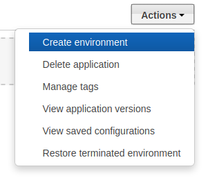
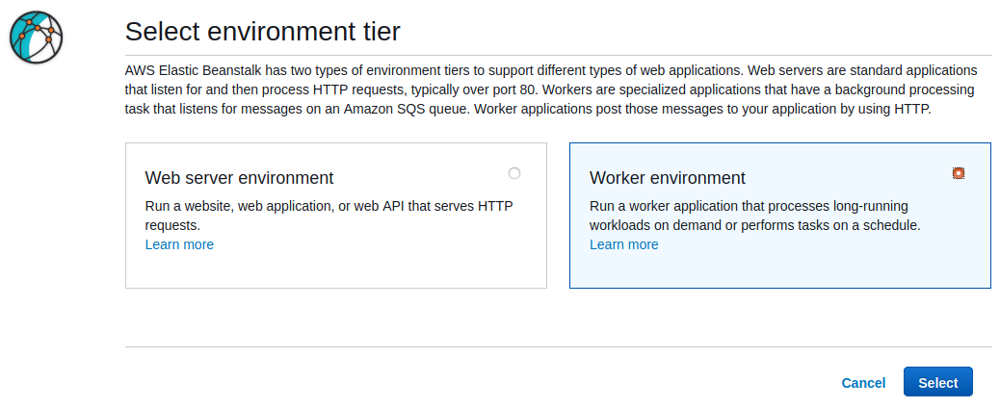
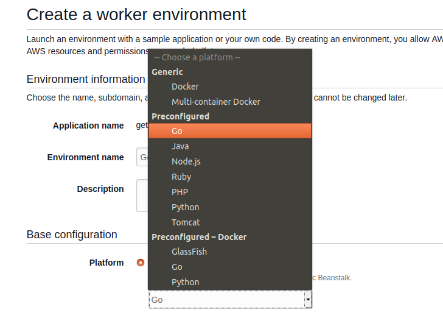
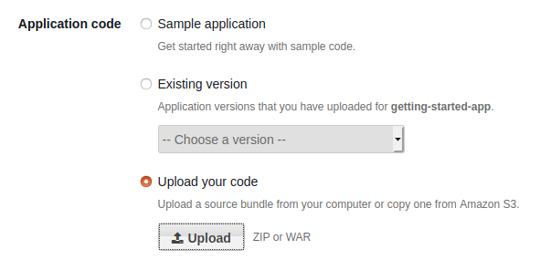
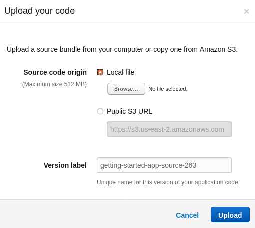
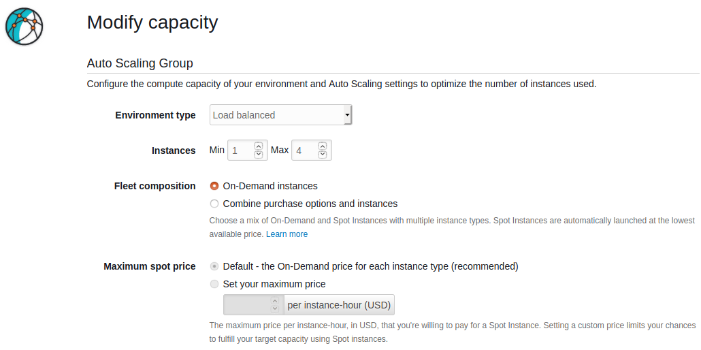
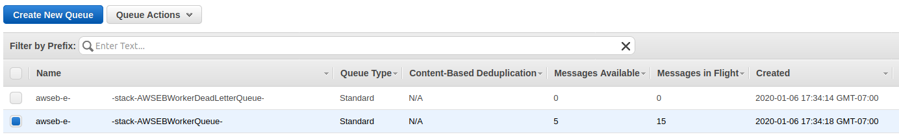

# Dufflebag

Dufflebag is a tool that searches through public Elastic Block Storage (EBS) snapshots for secrets that may have been accidentally left in. You may be surprised by all the passwords and secrets just laying around!

The tool is organized as an Elastic Beanstalk ("EB", not to be confused with EBS) application, and definitely won't work if you try to run it on your own machine.

Dufflebag has a lot of moving pieces because it's fairly nontrivial to actually read EBS volumes in practice. You have to be in an AWS environment, clone the snapshot, make a volume from the snapshot, attach the volume, mount the volume, etc... This is why it's made as an Elastic Beanstalk app, so it can automagically scale up or down however much you like, and so that the whole thing can be easily torn down when you're done with it.

Just keep an eye on your AWS console to make sure something it's going haywire and racking up bills. We've tried to think of every contingency and provide error handling... but you've been warned!

# Getting Started

## Permissions
You'll need to add some additional AWS IAM permissions to the role: `aws-elasticbeanstalk-ec2-role`. Alternatively, you can make a whole new role with these permissions and set EB to use that role, but it's a little more involved. In any case, you'll need to add:

* AttachVolume (ec2)
* CopySnapshot (ec2)
* CreateVolume (ec2)
* DeleteSnapshot (ec2)
* DeleteVolume (ec2)
* DescribeSnapshots (ec2)
* DescribeVolumes (ec2)
* DetachVolume (ec2)
* PurgeQueue (sqs)
* ListQueues (sqs)
* ListAllMyBuckets (s3)
* PutObject (s3)

## Building

The core application is written in Go, so you'll need a Golang compiler. But the EB application is actually built into a .zip file (that's just how EB works) so the makefile will output a zip for you.

1. Check your region. Dufflebag can only operate in one AWS region at a time. If you want to search every region, you'll have to deploy that many instances. To change the region, change the contents of the source code file `region.go`.

2. Install dependencies: Ubuntu 18.04 x64:

```
sudo apt install make golang-go git
go get -u github.com/aws/aws-sdk-go
go get -u github.com/deckarep/golang-set
go get -u github.com/lib/pq
go get -u lukechampine.com/blake3
```

3. Then build the EB app into a zip file with:

```
make
```

You should now see a `dufflebag.zip` file in the root project directory.

4. Lastly, you'll need to make an S3 bucket. Setting this up automatically within Dufflebag might be possible, but it'd actually be pretty hard. So just do it yourself. You just need to make an S3 bucket with default permissions, and have the name start with `dufflebag`. S3 bucket names have to be globally unique, so you'll probably need to have some suffix that is a bunch of gibberish or something.

## Deploying to Elastic Beanstalk

Go to your AWS console and find the Elastic Beanstalk menu option. This is probably doable via the CLI too, but this description will use the console. Select `Actions -> Create Environment`.



Then in the next window choose `Worker environment` and hit `Select`.



In the next window, choose `Preconfigured -> Go` for the `Platform`.



 Under `Application Code`, choose `Upload your Code`.



Hit the `Upload` button and select the `dufflebag.zip` that you just built.



Finally, hit `Create Environment` to get starting.

It will take a few minutes for AWS to make all the things and get started. Once created, Dufflebag will get started right away. No need to do anything else.

## Remove the Safety Valve

Once you have this up and running, you can try again with the safety valve removed. By default, Dufflebag only searches 20 EBS snapshots. (So that it doesn't go haywire on your very first try) In order to widen the search to the entire region, go into `populate.go`, remove the following line of code, and rebuild:

```
//#####################################################################
//####                    Safety Valve                             ####
//#### Remove this line of code below to search all of your region ####
//#####################################################################
snapshots = snapshots_result.Snapshots[0:20]
```

## Scaling Up

One of the reasons Dufflebag is designed as an Elastic Beanstalk app is so that you can automatically scale the program up or down easily. By default, it'll just run on one instance and be pretty slow. But if you'd like to juice it up a little, adjust the autoscaling in Elastic Beanstalk. The full options of this are a little outside the scope of this document, so I'll let you play with them. But in practice, I've found that a simple CPU use trigger works pretty well.

When setting up the environment above, you'll find the options under the `Configure more options` button (instead of hitting `Create environment`) and then hit `Scaling`.



## Getting The Stolen Goods

Dufflebag will copy out any interesting files out to the S3 bucket that you made earlier. (Technically, Dufflebag will use the first S3 bucket it finds who's name starts with "dufflebag".)

You can just watch the files come in one-by-one in your S3 bucket. They will be named:

`originalfilename_blake3sum_volumeid`

## Checking on Status

If everything is going well, you shouldn't need to read the logs. But just in case, Elastic Beanstalk lets apps write to log files as they run, and these are captured by navigating to the `Logs` tab. Then hit `Request Logs` and `Last 100 Lines`. This will get you the most recent batch of Dufflebag logs. Hit the `Download` button to read it. This file will contain a bunch of other system logs, but the Dufflebag part is under "/var/log/web-1.log" at the top.

In order to see the full log history, select `Full Logs` instead of `Last 100 Lines`. (Note that EB will rotate logs away pretty aggressively by default)

Additionally, you can get a sense of overall progress by looking at the SQS queue for the environment. Elastic Beanstalk worker environments use SQS to manage the workflow. Each message in the queue for Dufflebag represents an EBS volume to process:



The `Messages Available` column shows how many volumes have not yet been processed. The `Messages in Flight` column shows how many volumes are being processed right now.

## Tweaking what to Search For

Dufflebag is programmed to search for stuff we thought would be likely to be "interesting". Private keys, passwords, AWS keys, etc... But what if you really want to search for something specific to YOU? Like, maybe you work for bank.com and would like to see what's out there that references bank.com.

Doing so will require a minor amount of modification to the Dufflebag code, but not very much. Don't worry! The logic for what to search for happens in `inspector.go`. The `pilfer()` function is a goroutine that handles inspecting a file. The code there may look a little intimidating at first, but here's what it's doing. (And how you can modify that without much difficulty)

File name blacklists:
1. Check the file name against a blacklist. (`blacklist_exact`)
2. Check the file name against a "contains" blacklist. (Reject the file if it contains a given string) (`blacklist_contains`)
3. Check the file name against a prefix blacklist. (Reject the file if it starts with a given string) (`blacklist_prefix`)

You can modify the searching logic here pretty easily by just changing what's in those three lists. Though I'd in general recommend leaving these in tact. These blacklists are designed to cover boring files that are present in a lot of filesystems and prevents Dufflebag from needing to inspect in-depth every single file on all of AWS. Sensitive data you're looking for MIGHT be in those files... but probably not.

File name whitelist:
1. The `IsSensitiveFileName()` function checks the file name against a regular expression that finds sensitive file names. (Such as /etc/shadow, bash_history, etc...)

File contents:
1. The function `checkContentsRegex()` checks the file contents against a set of regular expressions. (The file input argument is line-by-line, so the input to this function is one line of a file, not the whole file.) So to look for keywords related to your organization, just change up the regular expressions inside `checkContentsRegex()`.
